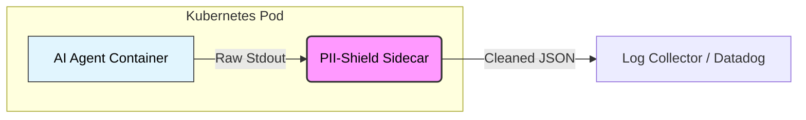

# Stop Leaking API Keys in your AI Agent Logs: A Go Sidecar Approach

**Subtitle:** The Hidden Privacy Leak in your AI Agents (and why your LLM "Audit Logs" are a GDPR Nightmare)

---

## 1. The Problem

Everyone is building AI agents right now. Whether you're using LangChain, AutoGPT, or custom loops, you are almost certainly logging their work. You keep traces of every step to debug reasoning loops or monitor costs.

**Here lies the pain:** Everything goes into these logs. User prompts, model responses, and raw JSON payloads from APIs.

### The Visualization
Imagine this scenario:

**Input Log:**
```json
{"user": "aragossa", "prompt": "My key is sk-live-123456"} 
```

**What your Logging System Saved:**
```json
{"user": "aragossa", "prompt": "My key is sk-live-123456"} 
```

If a user pastes their password, API key, or PII into the chat, or if an API returns a sensitive internal token, that data is now permanently etched into your Elasticsearch, Datadog, or S3 bucket.

**The Consequence:** Your fine-tuning dataset is now "poisoned" with real user data. This is a massive GDPR violation and a ticking security time bomb. You can't just "delete" it if you don't know where it is.

## 2. The Gap: Why usual methods fail

*   **Regex?** Good luck maintaining a regex list for every possible API key format, session token, and PII variation in existence. It’s a game of whack-a-mole you will lose.
*   **ML-based protection?** Too slow. If your agent operates in real-time, you cannot afford a 500ms roundtrip to a BERT model just to sanitize specific log lines. PII scans often become the bottleneck.
*   **Python-native logic?** Processing massive text streams in an interpreted language (like Python) adds significant CPU overhead per log line compared to a compiled Go binary. In high-throughput pipes, this latency adds up fast.
* **Existing Observability Tools?**
    Systems like Fluent Bit, Datadog, or OpenTelemetry already offer redaction and PII masking, usually via pattern rules and regex. For many workloads that’s perfectly fine. The trade‑off is that these pipelines are not optimized for AI‑agent traces: they either run late in the pipeline (after logs have already left the pod) or rely on configuration‑heavy pattern catalogs that are hard to keep up‑to‑date in a world of ever‑changing API keys and internal tokens.

    Static scanners like **TruffleHog** shine for repositories and CI, where you scan code at rest. They’re not meant to sit inline on a hot log stream and make sub‑millisecond decisions on every line.

    Where **PII‑Shield** is different is not in “inventing redaction”, but in the combination of techniques tailored for AI agents: entropy + bigram signals for unknown secrets, **deterministic HMAC** instead of `***` for referential integrity, and deep JSON traversal to keep your log schemas intact while still scrubbing sensitive values.

## 3. The Implementation: Enter PII-Shield

Meet **PII-Shield**. It’s a lightweight sidecar written in Go that sits right next to your agent.

### Killer Feature #1: Entropy-based Detection
We don't just search for "password=". We look for **chaos**.
API keys and authentication tokens naturally have high "entropy" (randomness/complexity). Normal human speech has low entropy. By calculating the mathematical complexity of strings, we can flag 64-character hex strings or base64 blobs without knowing their specific format.

### Killer Feature #2: Deterministic HMAC
This is the feature that caught attention on Hacker News.
We don't just replace secrets with `***`. We turn `secret123` into `[HIDDEN:a1b2c3]`.

**Input Log:**
```json
{"user": "aragossa", "prompt": "My key is sk-live-123456"} 
```

**PII-Shield Output:**
```json
{"user": "aragossa", "prompt": "My key is [HIDDEN:8f2a1b]"} 
```

**Why?**
This is a deterministic HMAC (Hash-based Message Authentication Code).
*   It allows you to **trace** a specific user or session across multiple log lines without knowing who they are.
*   It preserves **Referential Integrity** for debugging. You can see that "Session A" failed 5 times, but you validly cannot see the Session ID itself.

### Killer Feature #3: Statistical Adaptive Threshold
PII-Shield doesn't just use a hardcoded number. It learns the "baseline noise" of your logs. By calculating the mean and standard deviation ($2\sigma$), it automatically adjusts the sensitivity to your specific environment.

## 4. The Logic: Sidecar Architecture

The architecture is dead simple, leveraging the power of Kubernetes sidecars or UNIX pipes.



Your agent simply writes logs to stdout. PII-Shield intercepts the stream, scans it in real-time with near-zero overhead, sanitizes it, and passes it forward.

## 5. The Technical Meat

Why Go? Because we need raw speed and no dependencies.

### 1. Entropy & Bigrams (The Math)
Here is how we calculate the "Chaos" (Entropy) of a token in [scanner.go](https://github.com/aragossa/pii-shield/blob/main/pkg/scanner/scanner.go). We use a combination of Shannon Entropy, Character Class Bonuses, and English Bigram analysis.

The **Bigram Check** is crucial: it penalizes strings that look like valid English (common letter pairs) and boosts score for "unnatural" strings. (Note: This is optimized for English but can be disabled or tuned via `PII_DISABLE_BIGRAM_CHECK` for other languages).

```go
// From scanner.go
func CalculateComplexity(token string) float64 {
    // 1. Shannon Entropy
    entropy := calculateShannon(token) 

    // 2. Class Bonus (Upper, Lower, Digit, Symbols)
    // bonus := float64(classes-1) * 0.5
    bonus := calculateClassBonus(token) 

    // 3. Bigram Check (English Likelihood)
    // Penalizes common English, boosts random noise
    bigramScore := calculateBigramAdjustment(token) 

    return entropy + bonus + bigramScore
}
```

### 2. False Positives? (Whitelists)
"Entropy is great, but won't it eat my Git Hashes or UUIDs?"
PII-Shield includes built-in **Whitelists** ([isSafe](https://github.com/aragossa/pii-shield/blob/main/pkg/scanner/scanner.go#670-760) function) for standard identifiers like UUIDs, IPv6 addresses, Git Commit hashes (SHA-1), and MongoDB ObjectIDs. This ensures your debugging data stays intact while secrets get redacted.

### 3. Credit Card Detection (Luhn Algorithm)
Entropy isn't enough for credit cards, as numbers often have low randomness. PII-Shield includes a high-performance implementation of the **Luhn Algorithm** to scan for valid card checksums in the stream ([FindLuhnSequences](https://github.com/aragossa/pii-shield/blob/main/pkg/scanner/scanner.go#813-883)).

### 4. Deep JSON Inspection
For JSON logs, PII-Shield performs deep inspection ([processJSONLine](https://github.com/aragossa/pii-shield/blob/main/pkg/scanner/scanner.go#962-981)), preserving the schema while redacting values. 
*Note: PII-Shield re-serializes JSON (using `json.Marshal`), which may change key order/sorting. It guarantees semantic integrity but is best used early in your pipeline, before any byte-sensitive steps (like signing or exact-diff comparisons).*

### 5. Deterministic Redaction
Here is the HMAC logic using a secure Salt:

```go
func redactWithHMAC(sensitiveData string) string {
    // CurrentConfig.Salt is loaded securely from env vars
    mac := hmac.New(sha256.New, currentConfig.Salt)
    mac.Write([]byte(sensitiveData))
    hash := hex.EncodeToString(mac.Sum(nil))
    // We only keep a short prefix for tracing identity
    return fmt.Sprintf("[HIDDEN:%s]", hash[:6])
}
```

The main loop ([cmd/cleaner/main.go](https://github.com/aragossa/pii-shield/blob/main/cmd/cleaner/main.go)) is a highly efficient buffered reader:


```go
func main() {
    reader := bufio.NewScanner(os.Stdin)
    for reader.Scan() {
        text := reader.Text()
        // Core logic: 0 allocations for safe lines
        // Imports github.com/aragossa/pii-shield/pkg/scanner
        cleaned := scanner.ScanAndRedact(text) 
        fmt.Println(cleaned)
    }
}
```

### A Note on Scope: High-Entropy vs. Natural Language
Let's be clear: PII-Shield is laser-focused on **High-Entropy secrets** (API keys, tokens, auth headers) and structural patterns (Credit Cards). It is **not** a magic NLP bullet for detecting names like "John Smith" or free-text addresses. For that, you should treat PII-Shield as a low-latency "first line of defense" for your infrastructure, potentially complemented by heavier offline NLP tools for semantic analysis.

## 6. How to try it

I am looking for edge cases. If you are building AI agents, try running your trace logs through this and see what it catches (or misses).

You can run it locally with Docker:
`docker run -i -e PII_SALT="mysalt" pii-shield < logs.txt`

*   **GitHub**: [https://github.com/aragossa/pii-shield](https://github.com/aragossa/pii-shield)

**Why this matters:**
Security often trails behind innovation. With the explosion of AI Agents, we are generating massive amounts of sensitive data in logs. PII-Shield is a "drop-in" safety net to ensure your innovation doesn't become a liability.
